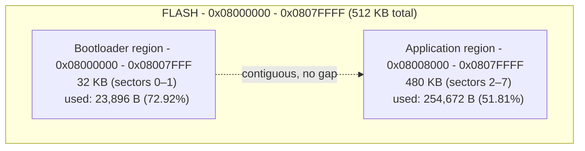

# Memory map
## Flash


## SRAM
```mermaid
  flowchart TB
      SRAM["SRAM — 0x20000000 – 0x2001FFFF (128 KB total)
  85,248 B used — 65.04%"]
      SRAM --> RING["s_ring — I2S capture ring buffer
  32,000 B (24.4%)"]
      SRAM --> ACT["ai_activations — STAI inference scratch
  18,252 B (13.9%)"]
      SRAM --> HEAP["ucHeap — FreeRTOS heap_4
  all 8 user-task stacks + xSensorQueue/xProcessorQueue/xButtonQueue + xButtonSemaphore + xWatchdogEvents
  16,384 B (12.5%)"]
      SRAM --> FRAME["frame + spectrum — mel_frontend.c FFT buffers
  8,192 B (6.3%)"]
      SRAM --> MAG["mag — magnitude spectrum
  2,052 B (1.6%)"]
      SRAM --> MFCCB["s_mfcc — feature output buffer
  1,960 B (1.5%)"]
      SRAM --> DMAB["s_raw_dma_buf — I2S DMA landing buffer
  1,024 B (0.8%)"]
      SRAM --> KERNEL["FreeRTOS idle + timer task internals
  statically allocated outside heap_4
  1,384 B (1.1%)"]
      SRAM --> OTHER["other globals, newlib stdio/locale state,
  small per-frame scratch, task/queue handles
  ~4,000 B (3.0%)"]
      SRAM --> FREE["unused
  45,824 B (35.0%)"]
  ```
