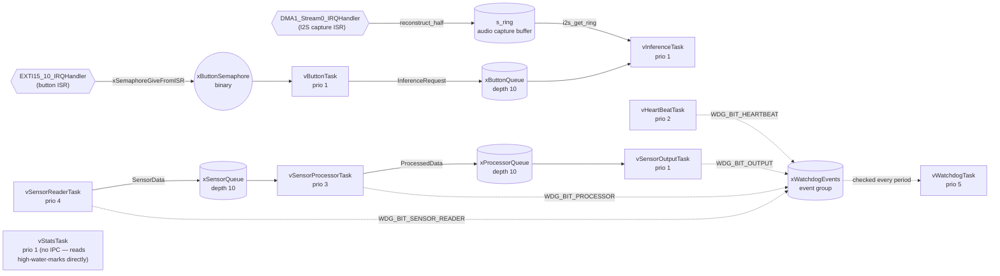

# Task graph

```mermaid
  flowchart LR
      EXTI{{"EXTI15_10_IRQHandler
  (button ISR)"}}
      DMA{{"DMA1_Stream0_IRQHandler
  (I2S capture ISR)"}}

      Reader["vSensorReaderTask
  prio 4"]
      Processor["vSensorProcessorTask
  prio 3"]
      Output["vSensorOutputTask
  prio 1"]
      HeartBeat["vHeartBeatTask
  prio 2"]
      Button["vButtonTask
  prio 1"]
      Inference["vInferenceTask
  prio 1"]
      Watchdog["vWatchdogTask
  prio 5"]
      Stats["vStatsTask
  prio 1 (no IPC — reads high-water-marks directly)"]

      SensorQ[("xSensorQueue
  depth 10")]
      ProcQ[("xProcessorQueue
  depth 10")]
      ButtonSem(("xButtonSemaphore
  binary"))
      ButtonQ[("xButtonQueue
  depth 10")]
      WdgEvents[("xWatchdogEvents
  event group")]
      Ring[("s_ring
  audio capture buffer")]
      Reader -->|SensorData| SensorQ --> Processor
      Processor -->|ProcessedData| ProcQ --> Output

      EXTI -->|xSemaphoreGiveFromISR| ButtonSem --> Button
      Button -->|InferenceRequest| ButtonQ --> Inference

      DMA -->|reconstruct_half| Ring -->|i2s_get_ring| Inference

      Reader -.->|WDG_BIT_SENSOR_READER| WdgEvents
      Processor -.->|WDG_BIT_PROCESSOR| WdgEvents
      Output -.->|WDG_BIT_OUTPUT| WdgEvents
      HeartBeat -.->|WDG_BIT_HEARTBEAT| WdgEvents
      WdgEvents -.->|checked every period| Watchdog
```
